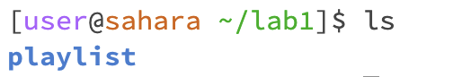

# Lab Report 1
### CSE 15L 
### Tusha Karnani

Instructions: 
1. A screenshot or Markdown code block showing the command and its output
2. What the working directory was when the command was run
3. A sentence or two explaining why you got that output (e.g. what was in the filesystem, what it meant to have no arguments).
4. Indicate whether the output is an error or not, and if it’s an error, explain why it’s an error.

---

### **Command `cd`**

1. using the command with no arguments

- The working directory when the command was run was `/home`.
- There was no output since the command is meant to change the directory but no desired directory/location in the filesystem was given.
- There was no error.

2. using the command with a path to a directory as an argument

- The working directory when the command was run was `/home`.
- I got this output because the working directory was changed to `/home/lab1/playlist/`, as is seen in the second line on the terminal.
- There was no error.

3. using the command with a path to a file as an argument

- The working directory when the command was run was `/home/lab1/playlist/`.
- The output was generated since we tried setting the working directory to a file instead of another directory.
- There was an error, informing us that we did not input a valid directory name.

---

### **Command `ls`**

1. using the command with no arguments

- The working directory when the command was run was `/home/lab1/`.
- The output lists the files/directories in the working directory. In this case it was just another directory called `playlist`.
- There was no error.

2. using the command with a path to a directory as an argument

- The working directory when the command was run was `/home/lab1/`.
- The output lists the files/directories in the directory that was input i.e. `/playlist` in the working one. In this case there were files called `song1.txt`,`song2.class` and `song2.java`.
- There was no error.

3. using the command with a path to a file as an argument

- The working directory when the command was run was `/home/lab1/playlist/`
- The output just contains the names of the files that we input.
- There was no error.

---

### **Command `cat`**

1. using the command with no arguments

- The working directory when the command was run was `/home/lab1/playlist/`.
- The terminal reads your input and prints it back.
- There was no error.

2. using the command with a path to a directory as an argument

- The working directory when the command was run was `/home/lab1/`.
- The output informs us that what we input was a directory and not a file whose contents could be printed out.
- There was an error, since we input a directory instead of a file. This command needs a file in order to print its contents.

3. using the command with a path to a file as an argument

- The working directory when the command was run was `/home/lab1/playlist/`
- The output just contains the contents of the file that we input.
- There was no error.

---
