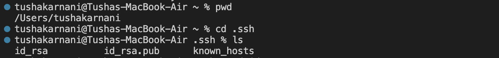

# Lab Report 2
### CSE 15L 
### Tusha Karnani

---

## **Part 1**

This is the code for StringServer.java

```
import java.io.IOException;
import java.net.URI;

class Handler implements URLHandler {
    String str = ""; 
    int num = 0;

    public String handleRequest(URI url) {
        if (url.getPath().equals("/")) {
            return str;
        }
        else {
            if (url.getPath().contains("/add-message")) {
                String[] parameters = url.getQuery().split("=");
                if (parameters[0].equals("s")) {
                    num += 1;
                    str += "\n" + num + ". " + parameters[1];
                    return str;
                }
            }
            return "404 Not Found!";
        }
    }
}

class StringServer {
    public static void main(String[] args) throws IOException {
        if(args.length == 0) {
            System.out.println("Missing port number! Try any number between 1024 to 49151");
            return;
        }
        int port = Integer.parseInt(args[0]);
        Server.start(port, new Handler());
    }
}
```

This is how I got the server running from the terminal


### Using /add-message


- The `handleRequest` method was called and the main method was run.
- The argument passed into the method is the URL. The relevant fields for our purposes of adding it to the output string are only the parameters added in after "/add-message?s=". So in this case, it was `String "Geisel"`.
- The value didn't change, it remained a string since it was to be added to the larger string that our server was printing.


- The `handleRequest` method was called and the main method was run.
- The argument passed into the method is the URL. The relevant fields for our purposes of adding it to the output string are only the parameters added in after "/add-message?s=". So in this case, it was `int 7`.
- The value changed to a string since it was to be added to the larger string that our server was printing.


- The `handleRequest` method was called and the main method was run.
- The argument passed into the method is the URL. The relevant fields for our purposes of adding it to the output string are only the parameters added in after "/add-message?s=". So in this case, it was `URI https://youtube.come`.
- The value changed to a string since it was to be added to the larger string that our server was printing.

---

## **Part 2**

Using the command line, show with ls and take screenshots of:




The images above show that:
- the path to the private key for my SSH key for logging into ieng6 (on my computer or on the home directory of the lab computer) is `/Users/tushakarnani/.ssh/id_rsa`.
- the path to the public key for my SSH key for logging into ieng6 (within my account on ieng6) is `/Users/tushakarnani/.ssh/id_rsa.pub`.


In the screenshots above, I log into ieng6 with my CSE 15L account on my own device without being asked for a password.
