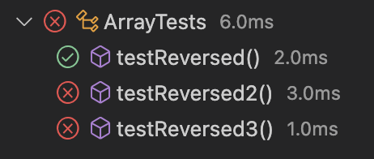
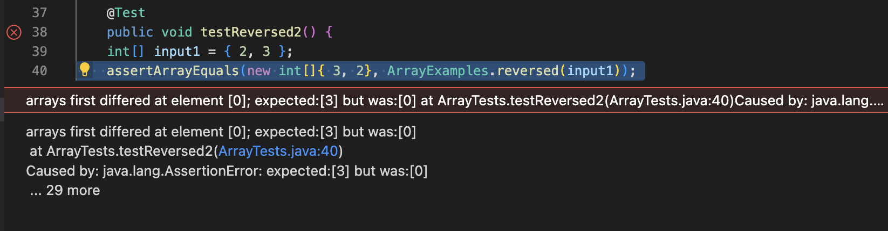
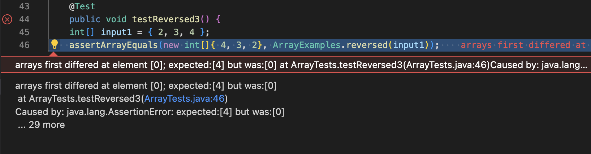

# Lab Report 3
### CSE 15L 
### Tusha Karnani

---

## **Part 1**

### `reversed` method for arrays

**A failure inducing input**
```
@Test
	public void testReversed2() {
    int[] input1 = { 2, 3 };
    assertArrayEquals(new int[]{ 3, 2 }, ArrayExamples.reversed(input1));
  }
```

**An input that doesn't induce failure**
```
@Test
	public void testReversed() {
    int[] input1 = { };
    assertArrayEquals(new int[]{ }, ArrayExamples.reversed(input1));
	}
```

**Symptoms - running JUnit tests**





**The bug**

This is the inital buggy code provided.

```
static int[] reversed(int[] arr) {
    int[] newArray = new int[arr.length];
    for(int i = 0; i < arr.length; i += 1) {
      arr[i] = newArray[arr.length - i - 1];
    }
    return arr;
  }
```

The is the code after fixing the bug.

```
static int[] reversed(int[] arr) {
    int[] newArray = new int[arr.length];
    for(int i = 0; i < arr.length; i += 1) {
      newArray[i] = arr[arr.length - i - 1];
    }
    return newArray;
  }
```

The code was initially adding elements from the new array into the old one instead of the other way around.
Changing the line of code inside the for loop to 'newArray[i] = arr[arr.length - i - 1];' and returning that array fixed the bug.

---

## **Part 2**

### `grep` command

## -r to recursively search for phrases

Source : Lectures and Labs

**on a directory**

While in the `docsearch` directory, I used `grep -r` on the `technical` directory for the phrase "plausible range".

```
tushakarnani@Tushas-MacBook-Air-2 docsearch % grep -r "plausible range" technical
technical/plos/pmed.0020016.txt:         The regional models were calibrated as follows: first, plausible
					 ranges were specified
technical/biomed/1471-2288-3-9.txt:      no statement of uncertainty or a plausible range of
```

**on a file** 

While in the `docsearch` directory, I used `grep -r` on a file in the `technical` directory for the phrase "plausible range" (that I already knew contained the phrase).

```
tushakarnani@Tushas-MacBook-Air-2 docsearch % grep -r "plausible range" technical/plos/pmed.0020016.txt
technical/plos/pmed.0020016.txt:         The regional models were calibrated as follows: first, plausible
					 ranges were specified
```

## -c to count the number of occurences of a word

Source : [Website to Grep commands in Linux](https://www.freecodecamp.org/news/grep-command-in-linux-usage-options-and-syntax-examples/#:~:text=Grep%20is%20a%20useful%20command,a%20powerful%20command%20to%20use.)

**on a directory**

While in the `docsearch` directory, I used `grep -c` on the `technical` directory for the phrase "microscopy". This caused an error because technical is a directory and not a file.

```
tushakarnani@Tushas-MacBook-Air-2 docsearch % grep -c "microscopy" technical
grep: technical: Is a directory
```

**on a file**

While in the `docsearch` directory, I used `grep -c` on a file in the `technical` directory for the phrase "microscopy".

```
tushakarnani@Tushas-MacBook-Air-2 docsearch % grep -c "microscopy" technical/biomed/1471-2121-3-11.txt
5
```

While in the `technical` directory, I used `grep -r -c` on a file in the `technical` directory for the phrase "microscopy". It recursively searched
