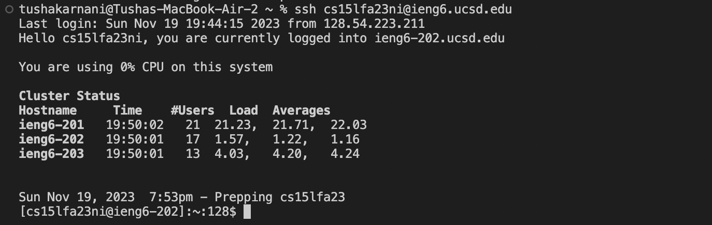
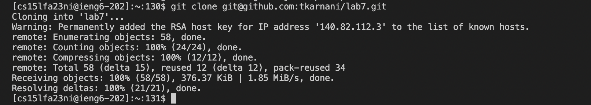
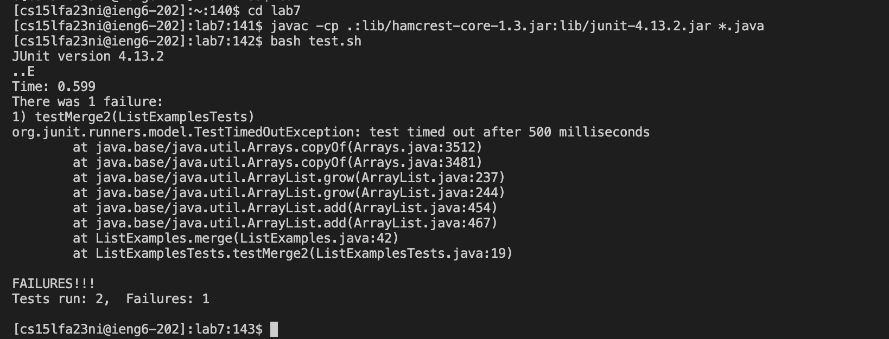
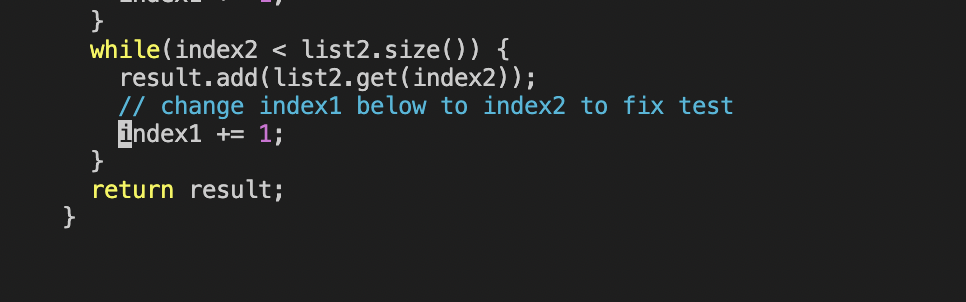
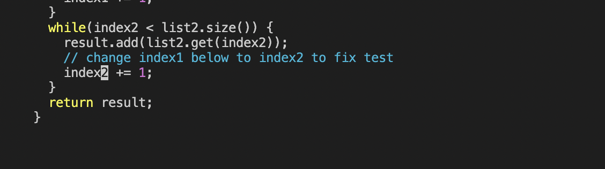
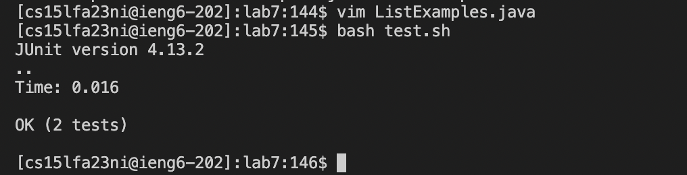
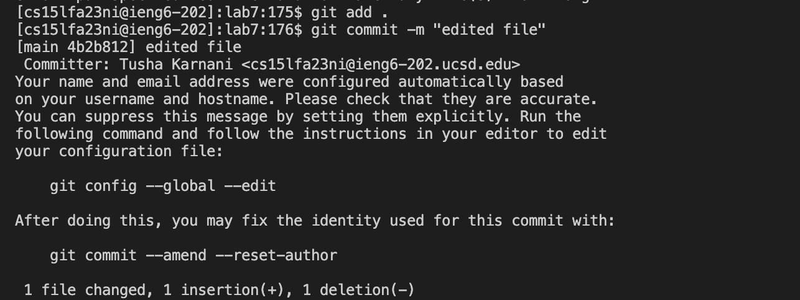
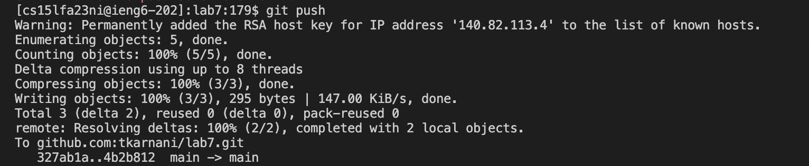

# Lab Report 4
### CSE 15L 
### Tusha Karnani

---

The steps I performed as a part of the lab report:

1. Delete any existing forks of the repository you have on your account
2. Fork the repository
3. **The real deal** - Start the timer!
4. Log into ieng6
5. Clone your fork of the repository from your Github account (using the SSH URL)
6. Run the tests, demonstrating that they fail
7. Edit the code file to fix the failing test
8. Run the tests, demonstrating that they now succeed
9. Commit and push the resulting change to your Github account (you can pick any commit message!)

---

### **Step 4:**

*Keys I pressed: `<up> <enter>`*

I simply had to press the *`<up>`* key once since the last and only command I ran in the home directory on my device was `ssh` with my key to log into my ieng6 machine.

### **Step 5:**

*Keys I pressed: `git clone` `Ctrl+V` `enter`*

I copied the SSH URL from my forked repository and pasted it onto my command line. This copied the existing Git repository into my local machine (in the working directory).

### **Step 6:**

*Keys I pressed: `cd lab7` `<enter>` then `Ctrl+R` `javac` `<enter>` then `Ctrl+R` `bash` `<enter>`*

The first command navigated to the cloned directory. The next searched for and ran my last javac command which was `javac -cp .:lib/hamcrest-core-1.3.jar:lib/junit-4.13.2.jar *.java`. This compiled the java files using the .jar files in lab7/lib. The next searched for and ran my last bash command which was `bash test.sh`. This shows us the results of running the tests i.e. that 2 tests run and 1 fails.

### **Step 7:**

*Keys I pressed: `Ctrl+R` `vim` `<enter>` then `:44` `<enter>` then `e` then `x` then `i` then `2` then `<esc>` then `:wq!`*

This took me to the file to edit, which was ListExamples.java. The rest of the commands I ran on the vim editor were a part of the process to edit the file i.e. to change "index1" to "index2". 

### **Step 8:**

*Keys I pressed: `<up><up><enter>`*

This ran the tests using `bash test.sh` again, and showed that all of them passed.

### **Step 9:**

*Keys I pressed: `git add .` then `git commit -m "edited file"` then `git push`*

This added, committed and pushed all the edits made to my forked repository on github.

The image above shows that the edits made got pushed and showed up as recent commits on my repository.
