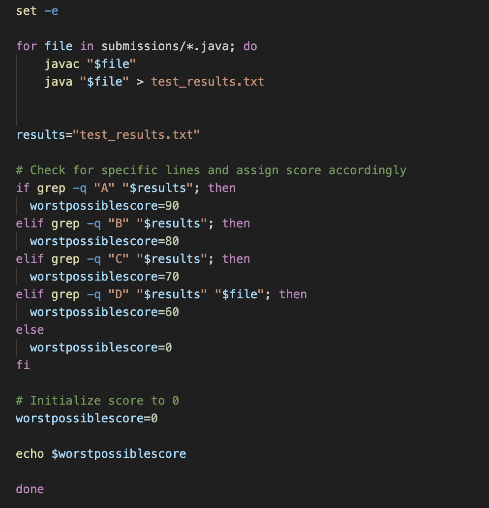
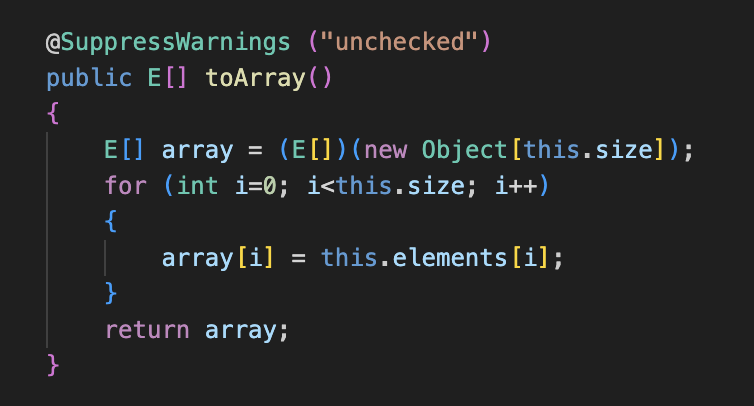
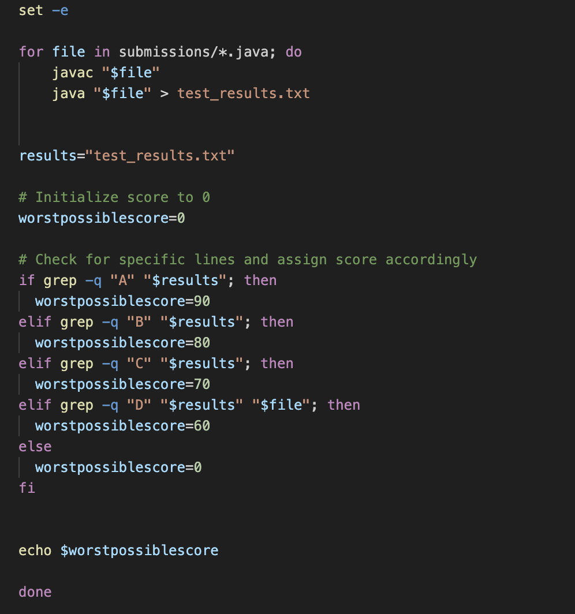
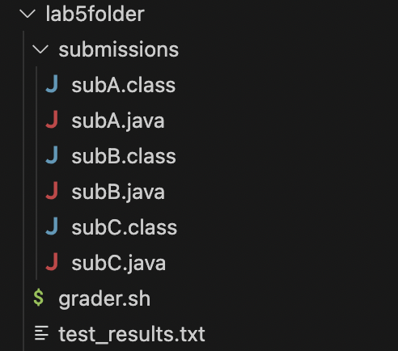

# Lab Report 5
### CSE 15L
### Tusha Karnani

---

URL: `https://edstem.org/us/courses/41619/discussion/3739201`

## **Part 1: EdStem chain**

## *Unexpected behavior in code*

#### *Tusha Karnani* (_15 hours ago in Labs_)

Hi, I run a bash script to the return the lowest possible scores a student could have gotten based on the letter grade they recieved. 
The main method in my java file contains the score for that particular student and runs the method while converts that score to a letter grade.
However, when I run the bash script for the students, the lowest possible score keeps returning as 0. 
I think it might have something to do with the bash script and my `worstpossiblescore` variable there instead of the java scripts, since it returns the same value for all of them.
How can I fix this?



This is the output I get on running the bash script.


This is an example of what a java script for a student looks like :


---

#### *Teaching Assistant* (_13 hours ago in Labs_)

Hi, thanks for providing all the code and context.

You're right, your problem does have to with the `worstpossiblescore` variable and its initialization. Look at where you initialize it and where its value is edited after that. Focus on the local scopes of variables; (_wink wink_).

---

#### *Tusha Karnani 1* (_5 hours ago in Labs_)

Hi, thank you so much!
I realized that my code set my `worstpossiblescore` variable at the end of if-statements, right before it got returned.
I changed it to be initialized right before the statments so that the if-statements can change its value.




---


#### The file and directory structure



#### Contents of all the files before fixing the bug

**grader.sh**

```
set -e

for file in submissions/*.java; do
    javac "$file"
    java "$file" > test_results.txt

results="test_results.txt"

# Check for specific lines and assign score accordingly
if grep -q "A" "$results"; then
  worstpossiblescore=90
elif grep -q "B" "$results"; then
  worstpossiblescore=80
elif grep -q "C" "$results"; then
  worstpossiblescore=70
elif grep -q "D" "$results" "$file"; then
  worstpossiblescore=60
else
  worstpossiblescore=0
fi

# Initialize score to 0
worstpossiblescore=0

echo $worstpossiblescore

done
```

**subA.java**

```
package lab5folder.submissions;

public class subA {

    public static String scoreToGrade(int score)
    {
  if (score > 90) {
    return "A";
  } else if (score > 80) {
    return "B";
  } else if (score > 70) {
    return "C";
  } else if (score > 60) {
    return "D";
  } else {
    return "F";
  }
}

  public static void main (String[] args) {
        int score = 100;
    System.out.println(scoreToGrade(score));
  }

}
```

**subB.java**

```
package lab5folder.submissions;

public class subA {

    public static String scoreToGrade(int score)
    {
  if (score > 90) {
    return "A";
  } else if (score > 80) {
    return "B";
  } else if (score > 70) {
    return "C";
  } else if (score > 60) {
    return "D";
  } else {
    return "F";
  }
}

  public static void main (String[] args) {
        int score = 84;
    System.out.println(scoreToGrade(score));
  }

}
```

**subC.java**

```
package lab5folder.submissions;

public class subA {

    public static String scoreToGrade(int score)
    {
  if (score > 90) {
    return "A";
  } else if (score > 80) {
    return "B";
  } else if (score > 70) {
    return "C";
  } else if (score > 60) {
    return "D";
  } else {
    return "F";
  }
}

  public static void main (String[] args) {
        int score = 73;
    System.out.println(scoreToGrade(score));
  }

}
```

#### Command line I ran to trigger the bug

`bash grader.sh`


#### Description of the edit to fix the bug

In the bash script, my `worstpossiblescore` variable was initialized at the wrong place.
I changed it to be initialized right before the statments so that the if-statements can change its value.


---

URL: `https://edstem.org/us/courses/41619/discussion/3739201`

## **Part 2: Reflection**

Some things I learnt from lab in the second half of the quarter were:

- How to edit in the terminal using `vim`. I always knew that the terminal was useful for switching around directories and working with files on your system but finding out that you could actually edit file content on the terminal was super insightful. I actually found vim super cool and think I'll be using it.
- `Nano`. During lecture, Joe mentioned the fact that he's not very fond of vim and that he uses nano for such tasks instead. This made me look nano up and try it out a bit after watching some videos. That also looks like a super cool tool.
- Using the java debugger was also interesting since before that I simply used to use the trace and debug functions on vs code. That also used to help me figure out what my code does and the changes it makes to variable and when.

In a couple of sentences, describe something you learned from your lab experience in the second half of this quarter that you didn’t know before. It could be a technical topic we addressed specifically, something cool you found out on your own building on labs, something you learned from a tutor or classmate, and so on. It doesn’t have to be specifically related to a lab writeup, we just want to hear about cool things you learned!

