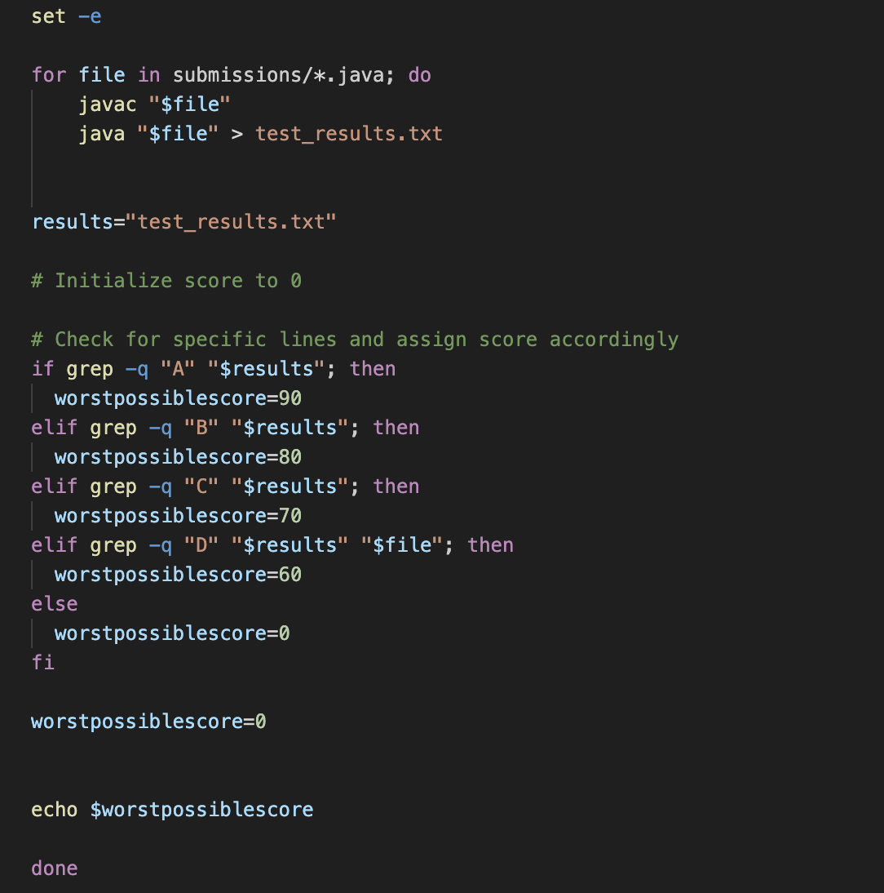
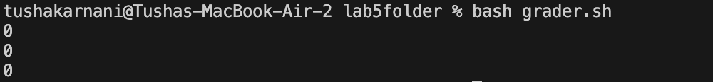

# Lab Report 5
### CSE 15L
### Tusha Karnani

---

URL: `https://edstem.org/us/courses/41619/discussion/3739201`

## **Unexpected behavior in code**

#### *Tusha Karnani* (_15 hours ago in Labs_)

Hi, I run a bash script to the return the lowest possible scores a student could have gotten based on the letter grade they recieved. 
The main method in my java file contains the score for that particular student and runs the method while converts that score to a letter grade.
However, when I run the bash script for the students, the lowest possible score keeps returning as 0. 
I think it might have something to do with the bash script and my worstpossiblescore variable there instead of the java scripts, since it returns the same value for all of them.
How can I fix this?

This is the output I get on running the bash script.

This is an example of what a java script for a student looks like :

---

#### *Teaching Assistant* (_13 hours ago in Labs_)

Hi, thanks for providing all the code and context.

You're right, your problem does have to with the worstpossiblescore variable and its initialization. Look at where you initialize it and where its value is edited after that. Focus on the local scopes of variables; (_wink wink_).

---

#### *Tusha Karnani 1* (_5 hours ago in Labs_)

---

#### The file and directory structure

